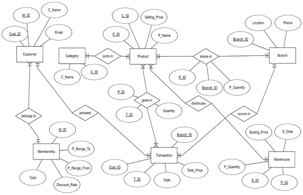
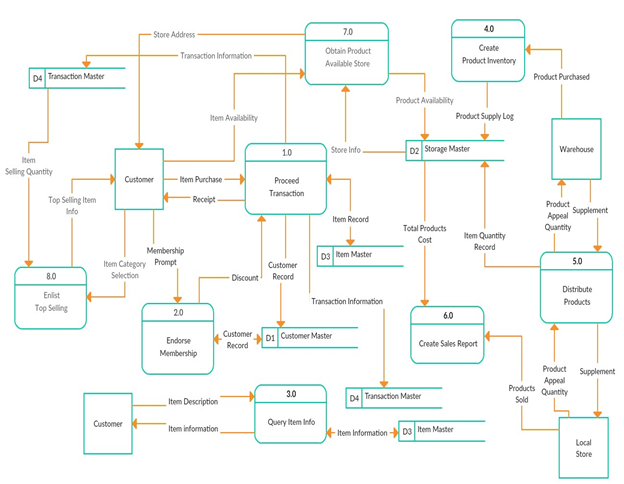
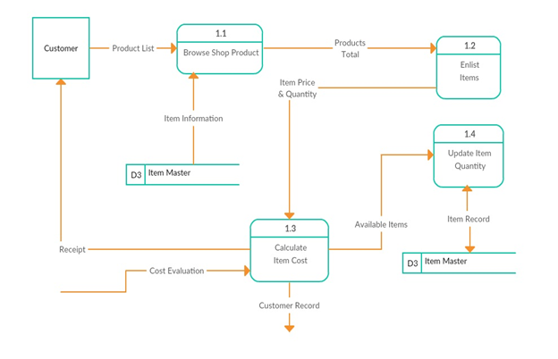
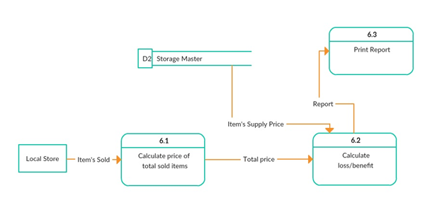
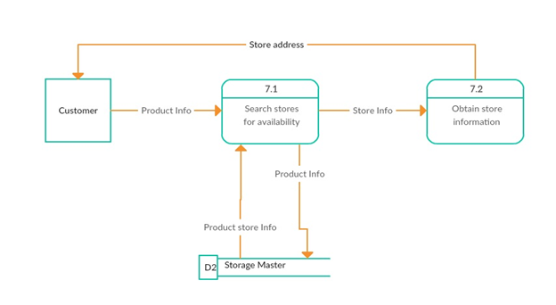
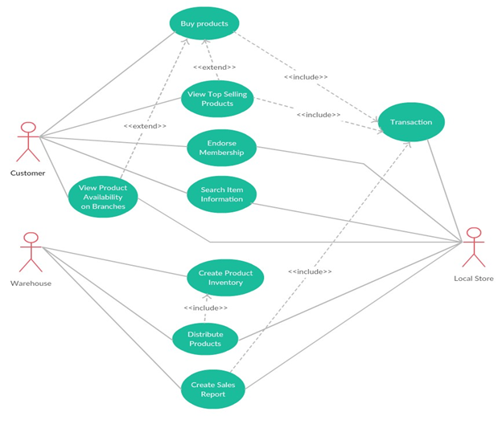

# SuperShop_Mania
A C# project based on super shop.

## Features

1.	Customer buys product, local store sells product, and therefore transaction happens.
2.	Customer can be approved for membership.
3.	Customer can search item for information and reliability.
4.	Warehouse has product inventory.
5.	Warehouse can distribute products to local store.
6.	There will be monthly, weekly or daily sales report.
7.	Customer can search in different stores for product availability.
8.	Customer can see top selling products of specific category

## Platforms

•	Programming Language :  C#
•	IDE :  Visual Studio
•	Database:  MySQL

## ERD of the project

## Data Flow Diagram

Level 0 diagram
        

Level 1 diagram

Level 1 diagram

Level 1 diagram

Level 1 diagram

Level 1 diagram

Level 1 diagram

Level 1 diagram

Level 1 diagram

## Use Case

