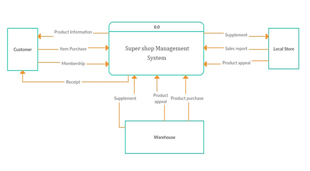
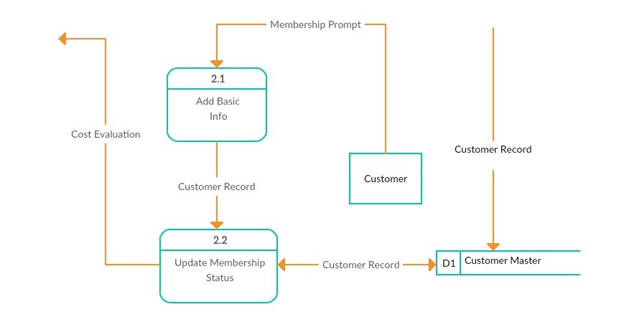
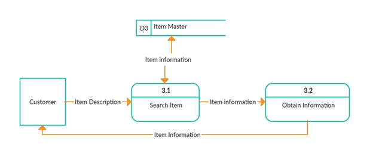
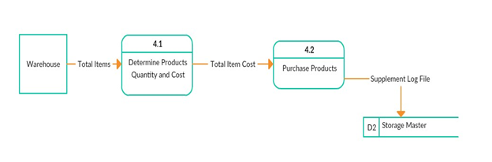
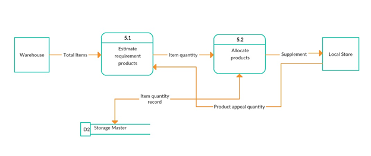
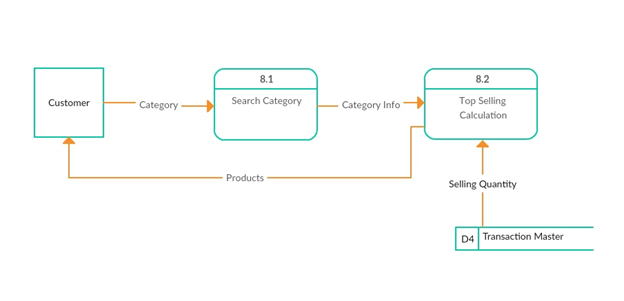

# SuperShop_Mania
A C# project based on super shop.

## Features

1.	Customer buys product, local store sells product, and therefore transaction happens.
2.	Customer can be approved for membership.
3.	Customer can search item for information and reliability.
4.	Warehouse has product inventory.
5.	Warehouse can distribute products to local store.
6.	There is monthly, weekly and daily sales report.
7.	Customer can search in different stores for product availability.
8.	Customer can see top selling products of specific category

## Platforms

1.	Programming Language :  C#

2.	IDE :  Visual Studio

3.	Database:  MySQL

## Entity Relationship Diagram

### Entity Sets

•	Customer
•	Branch
•	Membership
•	Product
•	Transaction
•	Warehouse
•	Category

## Data Flow Diagram

### Context Diagram

From context diagram, we can see that we have three entities in our system. The entities are customer, local store, and warehouse. Customer can purchase item, get information of items, and can get membership. Local store will fetch items from warehouse and warehouse will provide those items.

### Level 0 diagram
        

In level 0 diagram, we break down the context diagram in several processes. In Query item info process, customer can get item information. Customer can buy their desire product and get the total cost receipt in proceed transaction. Customer can get membership and discount from endorse membership process based on their transaction. Customer can view top selling products from top-selling process. Customer can also get store addresses for a specific product.  Warehouse will provide desired quantities of item, which are necessary for local stores. At the end of week, month or year a sales report will be created to view loss benefits.

### Level 1 diagram

Here customer will browse shop items for his desired product. Then those items will be enlisted and the total cost will be calculated. If the customer is a member of super shop his transaction cost will be evaluated. Based on transaction of products item quantity will be updated.

### Level 1 diagram

Customer’s basic information will be stored and according to regular purchase, their membership status will be updated.

### Level 1 diagram

Customer will get the necessary items information. 

### Level 1 diagram

Determining the total products quantity and cost of warehouse supplement, supplement log file will be stored on database.

### Level 1 diagram

Local store can appeal for products and warehouse will provide those to local store.

### Level 1 diagram

Based on sold item, total price will be calculated. Comparing with item’s supply price, loss/benefit will be calculated and sales report will be printed. 

### Level 1 diagram

If product is not available in the branch, product availability on other branch will be provided to the customer.

### Level 1 diagram

Customer will provide category and will get the top selling products information.

## Use Case

### Actors

1. Customer: 
Customers will be able to buy products, view top-selling products and get membership, search item information and view product availability on different stores.

2. Local Store:
Local store will be able to request for products and will be useful in creating sales report.

3. Warehouse:
Warehouse will provide necessary products to local stores and will be useful in creating sales report. 

